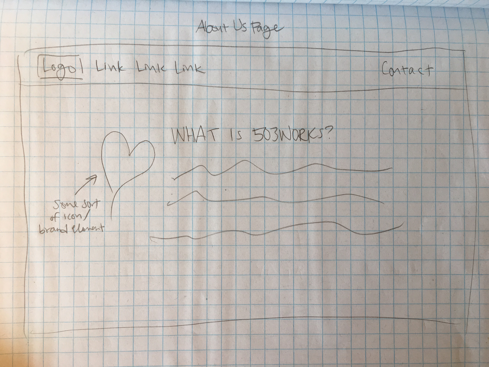
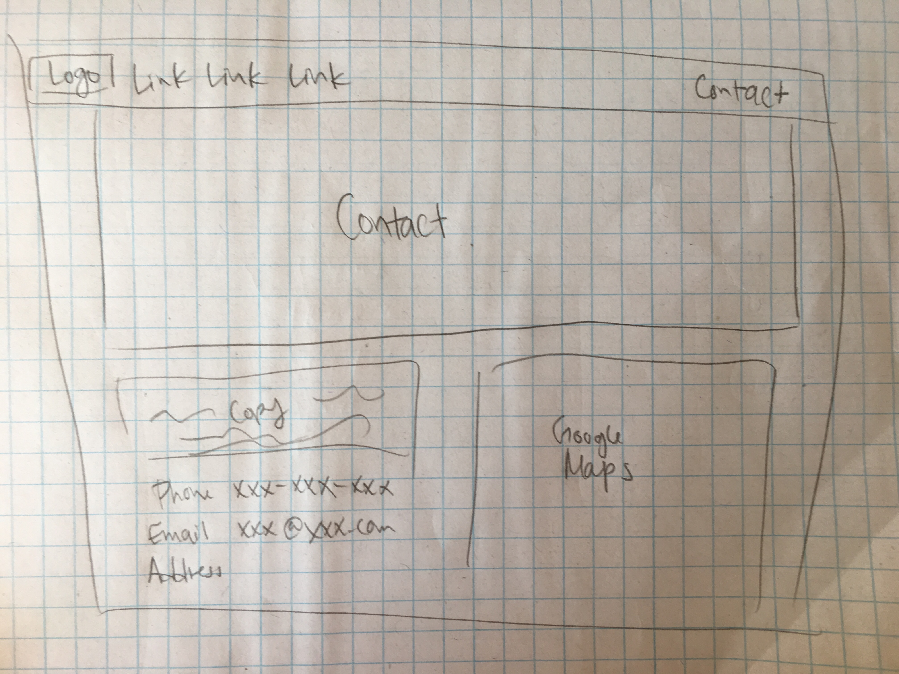

## 503Works Co-Working Start-up Site
---

#### By Nikki Wong
#### Sep. 14, 2018

### Description

This website is the official website for a co-working start-up concept called 503Works located in the downtown Portland area.

### Images
<!--
#### Desktop Version

#### Mobile Version

 -->

### User Stories

* Types of Users
  * Companies seeking to rent space
    * Tech companies
    * Traditional businesses
    * Creative agencies

* Target User Personas
  * John, 36
    * Tech startup CEO
    * Wants an office environment that feels up-to-par with current standards of tech company offices, different from a traditional office space
      * In particular, needs facilities and amenities above and beyond typical office facilities and amenities to attract top tech talent
    * Seeking an open space where employees can easily collaborate with one another
    * "I want to have our own space where we can all talk easily amongst one another and create innovative work"
  * Maria, 47
    * Owner of a small consulting business
    * Seeks to save money by renting out space in a co-working office rather than renting out an entire office herself for her small team
    * Wants a space that appears high-end and polished enough for when important clients or business partners stop by
    * "I want a nice home for my business that I can be proud of showing clients without paying an arm and a leg"
  * Andrew, 28
    * Creative director of a local design agency
    * Looking for an office space that facilitates creativity and collaboration while looking cool and trendy
    * "I want an aesthetically pleasing and open work space where ideas and creativity can flow freely"

### Research, Inspire, and Brainstorm

* Design ideas/brainstorming
  * Brand identity elements and site design based on office space images
    * Light, pastel aesthetic (mint/light pink/white)
    * Minimalist with a few patterns
    * Natural feeling
  * Open, clean design to convey image of open and clean office space to potential customers but with a few unique design elements to give personality and "local" feeling
  * Thin and light typefaces and black text
  * Large images of the space to place focus on the space itself and give sense of luxuriousness
    * Commonly seen on sites of other luxury facilities and brands
  * Incorporation of heart shapes/patterns (as seen in office space repeatedly; part of brand identity)

<a href="https://www.pinterest.com/nikkiawong/503works-moodboard/">Moodboard</a>

### Sketch

|   |  |
| ------------- | ------------- |
|   |   |
|   |   |

### Technologies and Resources

* Bootstrap
* jQuery
* Sass
* Sketch
<!--
### Responsiveness

This project is responsive. Content dimensions adjust based on viewport. -->

### Setup Instructions

* Clone this repository
* Open a simple HTTP server in the top level of the cloned directory
* Use git functions to add, commit, and push to the master branch in remote repository
<!--
### Roadmap

We would have liked to add a search function but we don't know how yet. -->

### License

Copyright (c) 2018 **_{ Nikki Wong }_**
